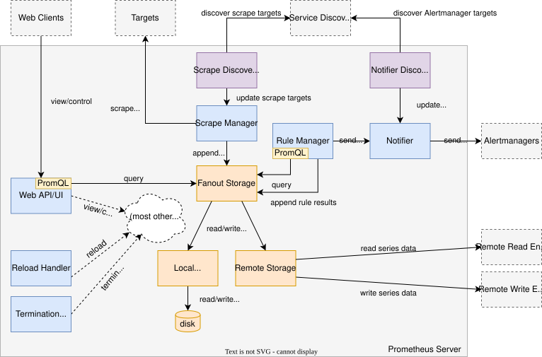

外部架构图


内部架构图




## 命令行查看信息

### 使用命令行查看prometheus有多少series
```bash
curl -g 'http://172.38.187.183:30090/api/v1/status/tsdb' | jq '.data.headStats.numSeries'
```

### 使用命令行查询指标数据

```bash
curl -s "http://172.38.187.183:30090/api/v1/query" \ --data-urlencode 'query=rate(prometheus_http_requests_total{handler="/api/v1/query"}[5m])' | jq
```

### 按照job分组统计每个Job有多少个target
```bash
curl -s "http://172.38.187.183:30090/api/v1/targets" | jq ' .data.activeTargets[] | .labels.job as $job | {job: $job} ' | jq -s 'group_by(.job) | map({job: .[0].job, count: length}) | sort_by(-.count)'
```


## 信息查看
### 查看配置

通过访问网址 : `ip:port/config` 即可查看启动状态下的 `prometheus` 的配置

```bash
http://10.161.40.240:30090/config
```

### 查看rules
通过访问网址：ip:port/rules可以查看一些规则设置

### 查看 `alert`

通过访问网页：ip:port/alerts可以查看报警规则设置


### 查看pprof

通过查看网页： `ip:port/debug/pprof` 能查看prometheus pprof数据，用于性能问题排查

### 查看通过外接通过监听之后生成的配置信息

```bash
cat  /etc/prometheus/config_out/prometheus.env.yaml
```


up{job="kubelet"}


- kube state metrics 指标

```plaintext
sum(kube_pod_container_status_restarts_total) by (pod)
sum(kube_pod_status_phase{phase!="Running"}) by (namespace, phase)
```


```bash
# 报警规则目录
# alertmanager.yaml要用kubectl create secret generic alertmanager-main --from-file=alertmanager.yaml -n base-services这样加进去
/opt/YsP-1/wp/prometheus/
```


prometheus的服务发现：

[服务发现](https://yunlzheng.gitbook.io/prometheus-book/part-iii-prometheus-shi-zhan/readmd/service-discovery-with-kubernetes)


## 关键参数

```bash
# 错误配置示例，如果Min max相同，wal将无法整理，最终碎片多会导致prometheus的内存升高，因为tsdb中的数据会经过mmap映射到内存中
- --storage.tsdb.max-block-duration=30m
- --storage.tsdb.min-block-duration=30m
```

## TSDB


prometheus整点，每隔两个小时，如果数据量足够大，会进行一次wal压缩，会导致大量的数据读取，可能会导致整点IO上升


## `prometheus operator`


在没有使用 `prometheus operator` 的环境中如果想配置 `prometheus` 的监控资源需要配置 `prometheus.yaml` 文件，在使用 `promeheus operator` 的环境中可以直接声明一个 `ServiceMonitor` 对象。


```yaml
apiVersion: monitoring.coreos.com/v1  
kind: ServiceMonitor  
metadata:  
  labels:  
    app.kubernetes.io/name: kube-state-metrics  
    app.kubernetes.io/version: 1.9.5  
  name: kube-state-metrics  
  namespace: base-services  
spec:  
  endpoints:  
  - bearerTokenFile: /var/run/secrets/kubernetes.io/serviceaccount/token  
    honorLabels: true  
    interval: 5s  
    port: https-main  
    relabelings:  
    - action: labeldrop  
      regex: (pod|service|endpoint|namespace)  
    scheme: https  
    scrapeTimeout: 5s  
    tlsConfig:  
      insecureSkipVerify: true  
  - bearerTokenFile: /var/run/secrets/kubernetes.io/serviceaccount/token  
    interval: 5s  
    port: https-self  
    scheme: https  
    tlsConfig:  
      insecureSkipVerify: true  
  jobLabel: app.kubernetes.io/name  
  selector:  
    matchLabels:  
      app.kubernetes.io/name: kube-state-metrics
```


## `kube-promethsu`


- 使用 `kube-prometheus` 安装 `prometheus`
```bash
$ kubectl apply -f manifests/setup
$ kubectl apply -f manifests/
```

- 从集群中删除 `prometheus`

```bash
$ kubectl delete --ignore-not-found=true-f manifests/ -f manifests/setup
```

- 或者为了简单可以使用 `-Rf` 参数进行 `apply` 但是可能需要执行多次，因为有些 `components` 之间是有依赖的

```bash
$ kubectl apply --server-side -Rf manifests
```


启动 `promehteus` 

```bash
kubectl create -f setup/  
kubectl create -f ./
```


### 数据类型


- `vector` 一组时间序列，所有时间序列共享时间戳，prometheus界面进行table查询的结果，path是 `/api/v1/query`，返回 resultType是vector
- `Metrix` 也叫 `range vector` 是一组时间序列，一段时间内的结果，对应界面上的 graph 查询，对应的查询接口是 `/api/v1/query_range` 
- `scalar`  table界面查询，查询数据是整数或者浮点数时，查询接口是：  `/api/v1/query`
- `string` 字符串类型


## node_export 

- node export 支持黑白名单，可以裁减掉部分指标的采集，这样才能降低之对主机性能的消耗
- 支持采集指定目录下符合指标标准的数据
- prometheus可以通过 `param` 配置指定 `node_export` 采集哪些数据，相当于prometheus采集数据时可以指定白名单


## `promtool`

`promtool` 是 Prometheus 提供的一个命令行工具，主要用于验证配置文件的正确性、调试规则和告警，以及对快照数据进行检查。

### 1. 验证 Prometheus 配置文件

在修改或更新 Prometheus 的配置文件之后，可以使用 `promtool` 来检查配置文件是否有效，避免因配置错误导致 Prometheus 服务无法正常启动。

```bash
promtool check config /path/to/prometheus.yml
```

- `/path/to/prometheus.yml`：替换为你的 Prometheus 配置文件的实际路径。

如果配置文件没有问题，`promtool` 不会输出任何信息；如果有问题，则会返回具体的错误信息。

### 2. 检查告警规则

Prometheus 支持定义告警规则来监控特定条件并触发告警。使用 `promtool` 可以确保这些规则文件是有效的。

假设你的告警规则文件位于 `/etc/prometheus/rules.yml`，你可以这样检查：

```bash
promtool check rules /etc/prometheus/rules.yml
```

这将验证规则文件中的语法是否正确，并提供有关任何错误的反馈。

### 3. 调试告警规则

除了检查规则文件外，还可以使用 `promtool` 对特定时间点的数据进行告警规则的评估，这对于调试很有帮助。

首先，你需要从 Prometheus 获取一个即时查询结果的快照（通常通过 API），然后使用 `promtool` 进行调试：

```bash
promtool debug rules /path/to/rules.yml --time="2025-07-14T11:27:00Z" --data=/path/to/instant-query-data.json
```

这里，`/path/to/instant-query-data.json` 是包含查询结果快照的 JSON 文件，`--time` 参数指定了评估的时间点。

### 4. 快照检查

如果你需要检查 Prometheus 快照数据的一致性和完整性，可以使用 `promtool` 的快照检查功能：

```bash
promtool check tsdb /path/to/snapshot_directory
```

这里的 `/path/to/snapshot_directory` 应该指向你想要检查的快照目录。

### 5. 数据查询与分析

虽然不是直接由 `promtool` 提供的功能，但结合 `curl` 或其他 HTTP 客户端工具，你可以使用 Prometheus 的 API 来执行查询，这对于调试非常有用。例如：

```bash
curl 'http://localhost:9090/api/v1/query?query=up&time=2025-07-14T11:27:00Z'
```

这条命令会查询 Prometheus 在指定时间点的 `up` 指标值。


## 常见问题排查

### pprof 数据获取

1. 确保 Prometheus 启动时包含：
```bash
--web.enable-pprof
```

2. 使用 `curl` 下载不同类型的 pprof 数据
- CPU Profiling(30s 采样)
```bash
curl -o profile.prof 'http://${IP}:9090/debug/pprof/profile?seconds=30'
```

- Heap Memory (堆内存分配)
```bash
curl -o heap.prof http://${IP}:9090/debug/pprof/heap
```

- Goroutines堆栈
```bash
curl -o goroutine.prof http://${IP}:9090/debug/pprof/goroutine?debug=2
```

- Block Profile (阻塞分析)
```bash
curl -o block.prof http://${IP}:9090/debug/pprof/block
```

- Mutex Contention (互斥锁争用)
```bash
curl -o mutex.prof http://${IP}:9090/debug/pprof/mutex
```

3. 使用 `go tool` 生成报告
```bash
# 启用go tool分析，然后输入 png命令生成报告
go tool pprof heap.prof
go tool pprof profile.prof

# 生成调用图 
go tool pprof -png heap.prof > heap.png 
# 生成火焰图（推荐），在线查看
go tool pprof -http=:8080 profile.prof
go tool pprof -http=${IP}:8080 profile.prof
```


### 排查问题指标说明

- `prometheus_http_requests_total` : http请求总数
1. 请求总数中有返回标签，可以根据标签查看 `prometheus` 当前数据采集状态
2. 通过 `sum` 等汉书来查看请求耗时等相关信息，查看那个 `pod` 的网络情况不好

- `prometheus_http_request_duration_seconds_bucket` : http请求耗时
1. 查看那个 `pod` 的网络情况不好，相应 `prometheus` 的数据采集不及时

- `prometheus_target_scrape_pools_failed_total` : scrape失败总数
1. 查询和 `target` 相关的指标，可以看那些指标抓取出现了问题

[[prometheus#作业和实例]]
每个job都会附带生成如下数据：
- `up{job="<job-name>", instance="<instance-id>"}` ：如果实例健康即可访问，则为 `1` 如果抓取失败，则为 `0` 。 -- 可用于排查抓取的目标或者job是否正常
- `scrape_duration_seconds{job="<job-name>", instance="<instance-id>"}` ：抓取的持续时间。 -- 可用于判断抓取目标是否健康，网络是否通畅，如果耗时异常升高可能是网络差或者被抓取对象响应慢导致的
- `scrape_samples_scraped{job="<job-name>", instance="<instance-id>"}` ：目标暴露的样本数。 -- 用于裁剪指标，可以提前统计采集的所有指标数量


### top显示RSS内存和heap抓取的不一致
#### 详细解释：Prometheus 内存组成的五大块

| 内存区域                  | 是否被 pprof heap 统计 | 大小估算        | 说明                           |
|-----------------------|-------------------|-------------|------------------------------|
| 1. Go 堆内存（Heap）       | ✅ 是               | ~300–500 MB | pprof 显示的就是这部分               |
| 2. TSDB mmap 文件映射     | ❌ 否               | 1.5–2 GB+   | 最大头！WAL 和 block 文件通过 mmap 加载 |
| 3. Goroutine 栈 & 内部结构 | ❌ 否               | ~100–300 MB | 每个 Goroutine 约 2KB 栈空间       |
| 4. 操作系统 Page Cache    | ❌ 否               | 几百 MB       | 内核缓存磁盘文件，算在 RES 里            |
| 5. 程序二进制、库、元数据        | ❌ 否               | ~100 MB     | ELF、符号表、VDSO、VVAR 等          |
